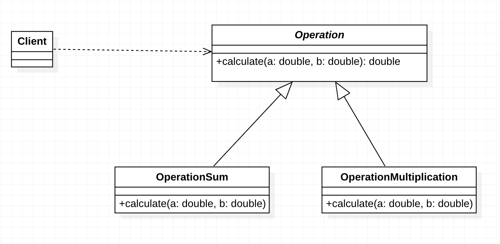
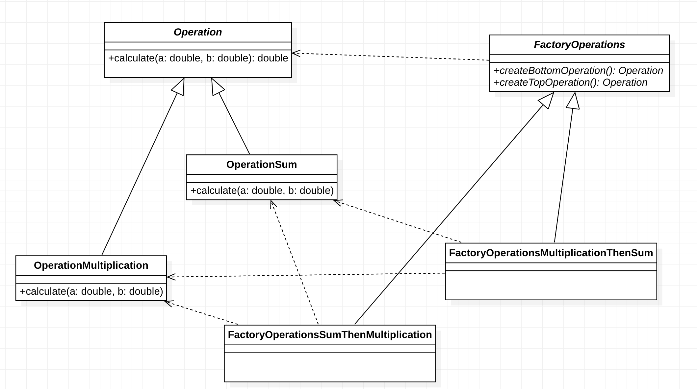
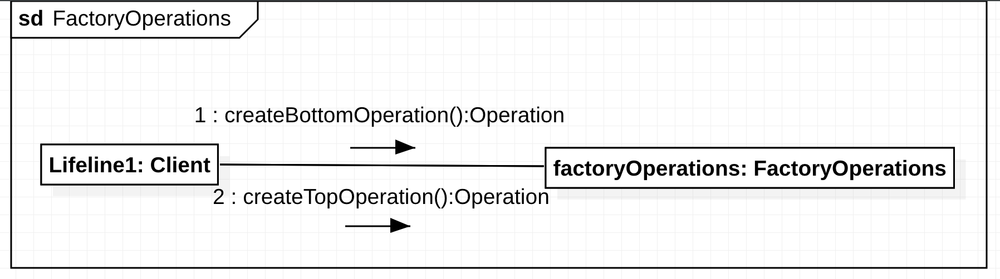
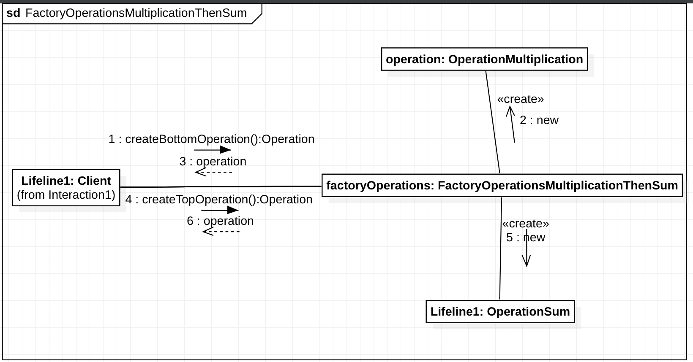

# Lista de Exercícios

## Identificação
**Professor**: Diego Pinheiro, PhD

**Disciplina**: Engenharia de Software 2

**Atividade**: Atividade 03 - Padrões de Projeto

## Instruções 
> 1. Sua implementação deve estar dentro da pasta src/**main**/java 
> 2. Não modifique nenhum código dentro da pasta src/**test**/java).
> 3. A submissão **não deve ser feita após o prazo** (nem 1 minuto a mais)

## Descrição da Atividade
### Questão 01
Utilize o padrão `Strategy` para definir uma família de algorítmos `Operation`. Esconda as decisões de projeto das operações de soma e multiplicação nas subclasses `OperationSum` e `OperationMultiplication`, respectivamente. 

### Questão 02
Utilize o padrão de projeto `AbstractFactory` para possibilitar a criação de estratégias `OperationSum` e `OperationMultiplication` através da interface `FactoryOperations`. Para a `FactoryOperationsSumThenMultiplication`, os métodos `createBottomOperation` e `createTopOperation` criam `OperationSum` e `OperationMultiplication`, respectivamente. Para a `FactoryOperationsMultiplicationThenSum`, os métodos `createBottomOperation` e `createTopOperation` criam `OperationMultiplication` e `OperationSum`, respectivamente.

