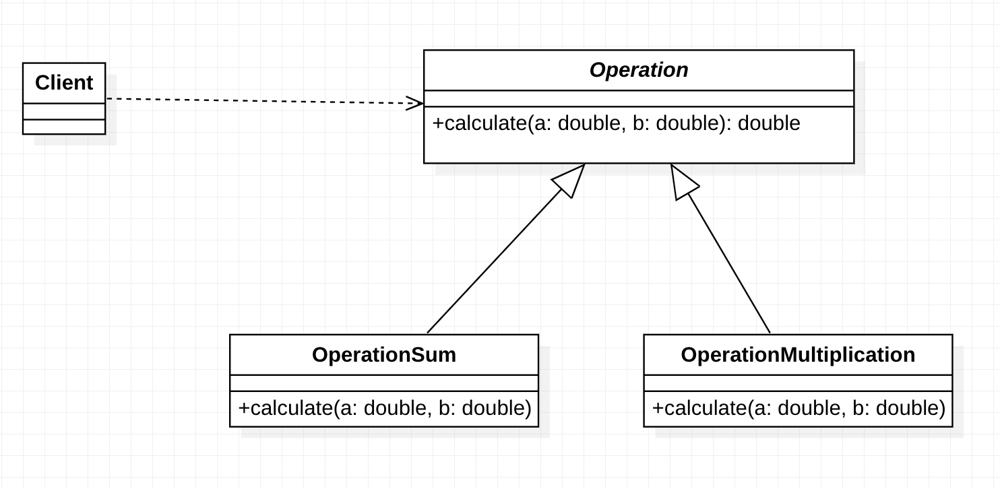
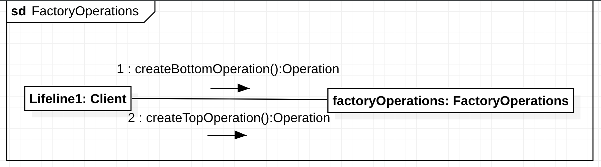
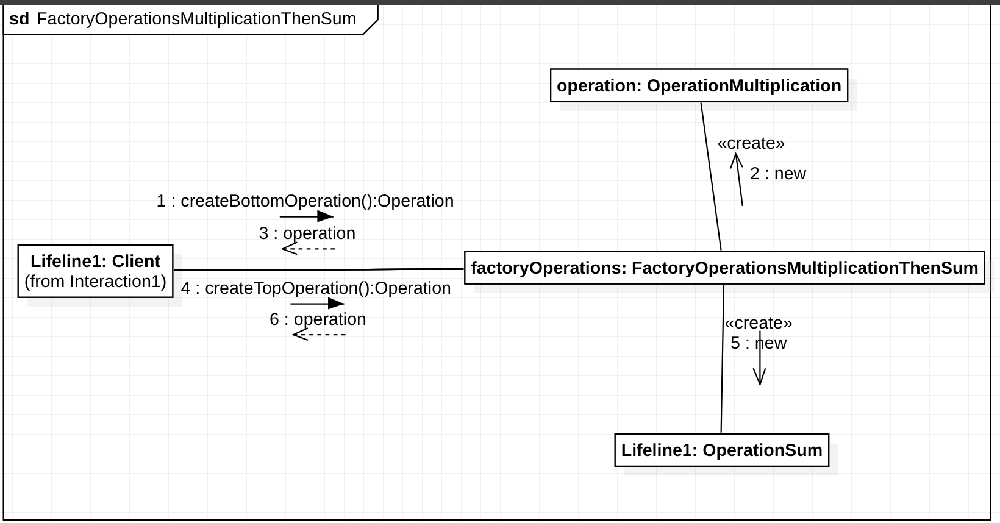
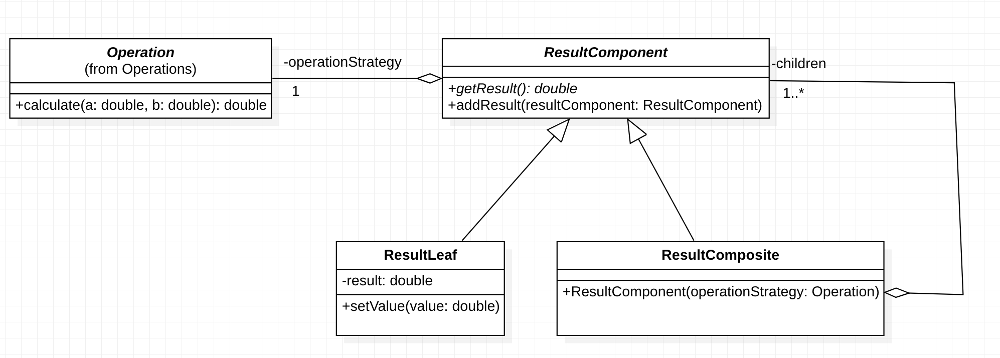
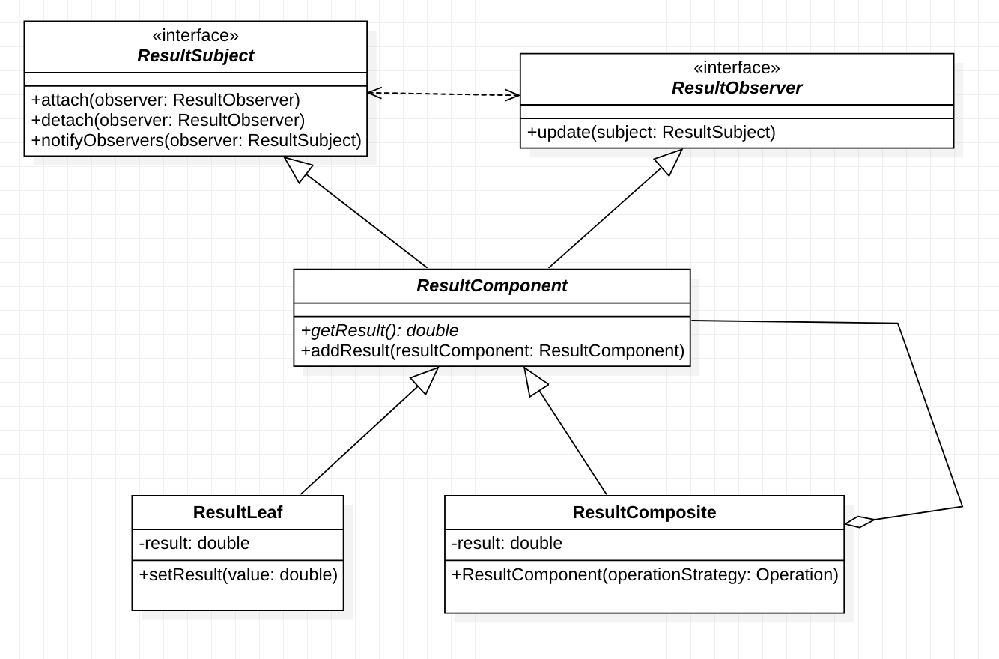
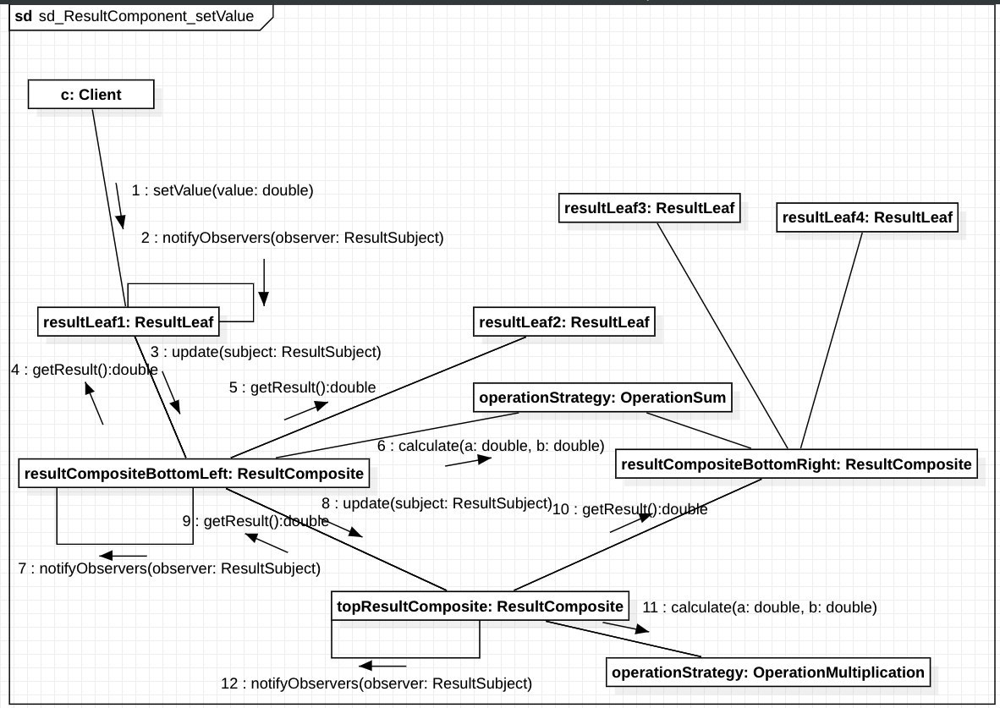

[](https://classroom.github.com/a/2185D6Pu)
[](https://classroom.github.com/online_ide?assignment_repo_id=11996310&assignment_repo_type=AssignmentRepo)
# Lista de Exercícios


## Identificação
**Professor**: Diego Pinheiro, PhD

**Disciplina**: Engenharia de Software 2

**Atividade**: Atividade 03 - Padrões de Projeto Parte 1s

## Instruções 
> 1. Sua implementação deve estar dentro da pasta src/**main**/java 
> 2. Não modifique nenhum código dentro da pasta src/**test**/java).
> 3. A submissão **não deve ser feita após o prazo** (nem 1 minuto a mais)

## Descrição da Atividade
### Questão 01
Utilize o padrão `Strategy` para definir uma família de algorítmos `Operation`. Esconda as decisões de projeto das operações de soma e multiplicação nas subclasses `OperationSum` e `OperationMultiplication`, respectivamente. 



### Questão 02
Utilize o padrão de projeto `AbstractFactory` para possibilitar a criação de estratégias `OperationSum` e `OperationMultiplication` através da interface `FactoryOperations`. Para a `FactoryOperationsSumThenMultiplication`, os métodos `createBottomOperation` e `createTopOperation` criam `OperationSum` e `OperationMultiplication`, respectivamente. Para a `FactoryOperationsMultiplicationThenSum`, os métodos `createBottomOperation` e `createTopOperation` criam `OperationMultiplication` e `OperationSum`, respectivamente.






### Questão 03
Utilize o padrão `Composite` para encapsular uma árvore de operações tratando objetos terminais `ResultLeaf` e composições de objetos `ResultComposite` de maneira uniforme através de uma interface comum `ResultComponent`. Implemente a classe `ResultBuilder` que recebe uma `FactoryOperations` no construtor e que, a partir do método 

```java
ResultComponent buildOperations(double[] leftValues, double[] rightValues)
```
, retorna uma árvore de operações `ResultComponent` constituída de um nó superior (`ResultComposite`) que contém 2 subárvores inferiores: uma à esquerda (`ResultComposite`) e uma à direita (`ResultComposite`). Cada uma dessas subárvores contém múltiplos nós do tipo folha (`ResultLeaf`) com os valores `leftValues` e `rightValues`, respectivamente.




### Questão 04
Utilize o padrão `Observer` para que alterações em `ResultComponent` propaguem-se através de notificações apenas para os `ResultComponent` dependentes, manténdo resultados de todos `ResultComponent` consistentes sem que seja necessário recalcular o resultado dos `ResultComponent` de toda a árvore. Para isso, `ResultComponent` deve implementar as interfaces `ResultSubject` e `ResultObserver`. A interface `ResultSubject` define os métodos 

```java
void attach(ResultObserver observer)
void detach(ResultObserver observer)
void notifyObservers(ResultComponent resultComponent)
```

A interface `ResultObserver` define o método 

```java
void update(ResultComponent resultComponent). 
```




