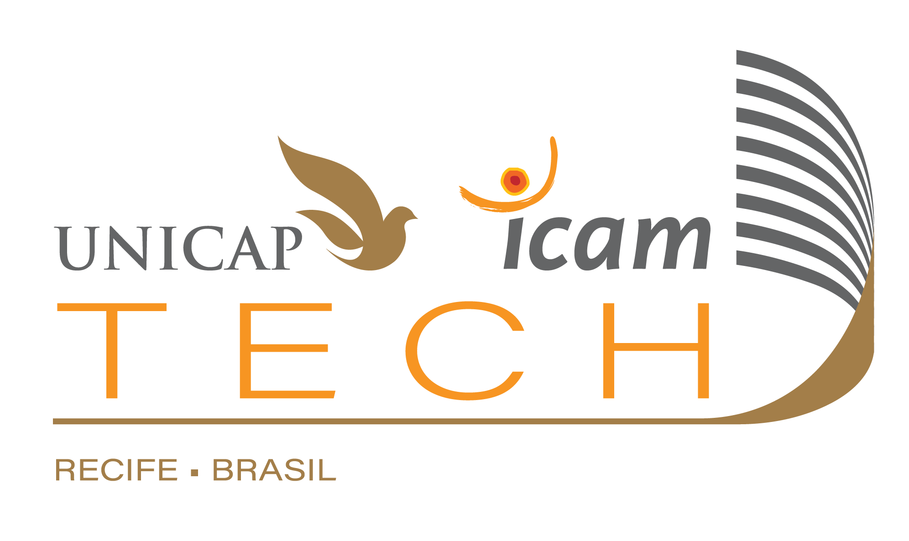

# Lista de Exercícios

## Identificação
**Professor**: DIEGO PINHEIRO

**Disciplina**:  ENGENHARIA DE SOFTWARE 2

**Atividade**: War Game

## Instruções 
> 1. Sua implementação deve estar dentro da pasta src/**main**/java 
> 2. Não modifique nenhum código dentro da pasta src/**test**/java).
> 3. A submissão **não deve ser feita após o prazo** (nem 1 minuto a mais)

## Colaboradores
- [Angelo Thiago](https://github.com/Angelogmc)
- [Arthur Franco](https://github.com/ArthurF36)
- [Franklin Dantas](https://github.com/Franklin-Dantas)
- [Hugo Leonardo](https://github.com/EclipseHugs)
- [João Gabriel](https://github.com/Gabrielabsalao24)
- [Luís Eduardo](https://github.com/LEDHU)

## Descrição da Atividade
### Jogo War
War é um popular jogo de tabuleiro estratégico de conquista. 
Jogado por 3 a 6 participantes, o objetivo é eliminar exércitos adversários
e conquistar continentes em um mapa mundial. 
A estratégia é crucial, com alocação de tropas, movimentação e combates. 
Cada jogador tem missões secretas, e o jogo combina habilidade tática com elementos de sorte, 
sendo adequado para uma ampla gama de jogadores.

'Imagem meramente ilustrativa'. Imagem não reflete a dinâmica desse projeto.
