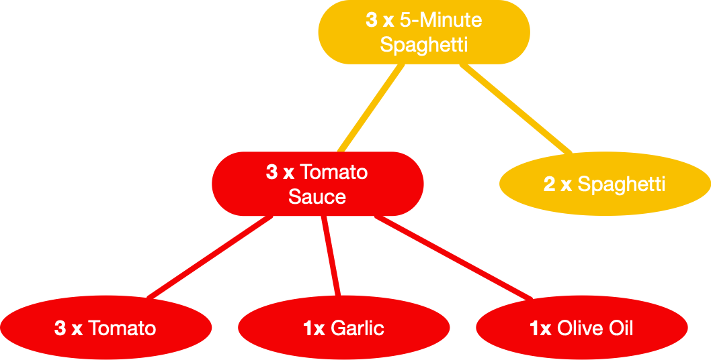

# Lista de Exercícios

## Identificação
**Professor**: Diego Pinheiro, PhD

**Disciplina**: Engenharia de Software 2

**Atividade**: Atividade 5

## Instruções 
> 1. Sua implementação deve estar dentro da pasta src/**main**/java 
> 2. Não modifique nenhum código dentro da pasta src/**test**/java).
> 3. A submissão **não deve ser feita após o prazo** (nem 1 minuto a mais)

## Descrição da Atividade
Considere o projeto de objetos de receitas culinárias anterior. Utilizando o conceito de `double dispath`, o padrão `Visitor` possibilitará representar operações distintas a serem executadas sobre os objetos terminais `IngredientLeaf` e composições de objetos `RecipeComposite`. 

## Questão 1
Remova as operações `getCalories`, `getIngredients` e `getProducts` das classes `RecipeComponent`, `RecipeComposite` e `IngredientLeaf`. Estes métodos serão implementados nos `CaloriesRecipeVisitor` (questão 4), `ProductsRecipeVisitor` (questão 5), e `IngredientsRecipeVisitor` (questão 6).

## Questão 2
Crie uma classe abstrata `RecipeVisitor` com as operações 
1.	public abstract void visit(RecipeComposite recipeComposite);
2.	public abstract void visit(IngredientLeaf ingredientLeaf);

## Questão 3
Altere a classe `RecipeComponent` e, para possibilitar o double dispatch, inclua a operação

1.	 public abstract void accept(RecipeVisitor visitor)

## Questão 4
Crie a classe `CaloriesRecipeVisitor` que extends de `RecipeVisitor` e implementa o método `getCalories()`. Para isso, a classe deve `overrides` as operações
1.	public void visit(IngredientLeaf ingredientLeaf)
2.	public void visit(RecipeComposite recipeComposite)

## Questão 5
Crie a classe `ProductsRecipeVisitor` que extends de `RecipeVisitor` e implementa o método `getProducts()`. Para isso, a classe deve `overrides` as operações
1.	public void visit(IngredientLeaf ingredientLeaf)
2.	public void visit(RecipeComposite recipeComposite)

## Questão 6
Crie a classe `IngredientsRecipeVisitor` que `extends` de `RecipeVisitor` e implementa o método `getIngredients()`. Para isso, a classe deve `overrides` as operações
1.	public void visit(IngredientLeaf ingredientLeaf)
2.	public void visit(RecipeComposite recipeComposite)
