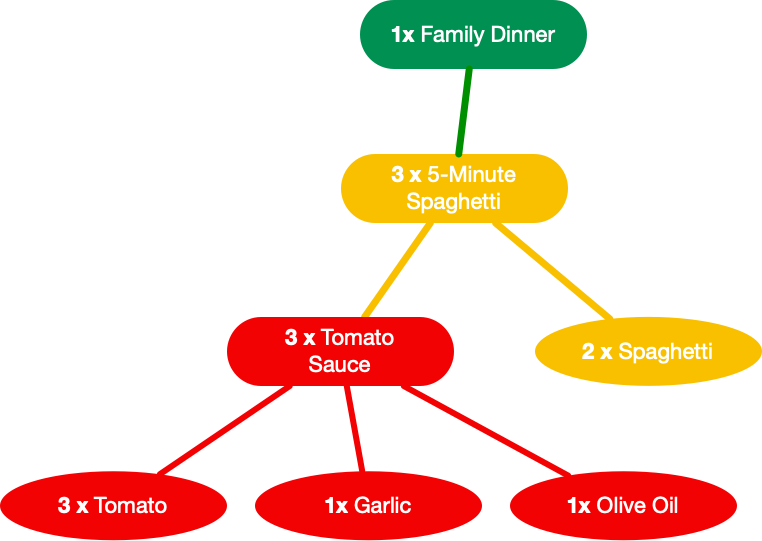
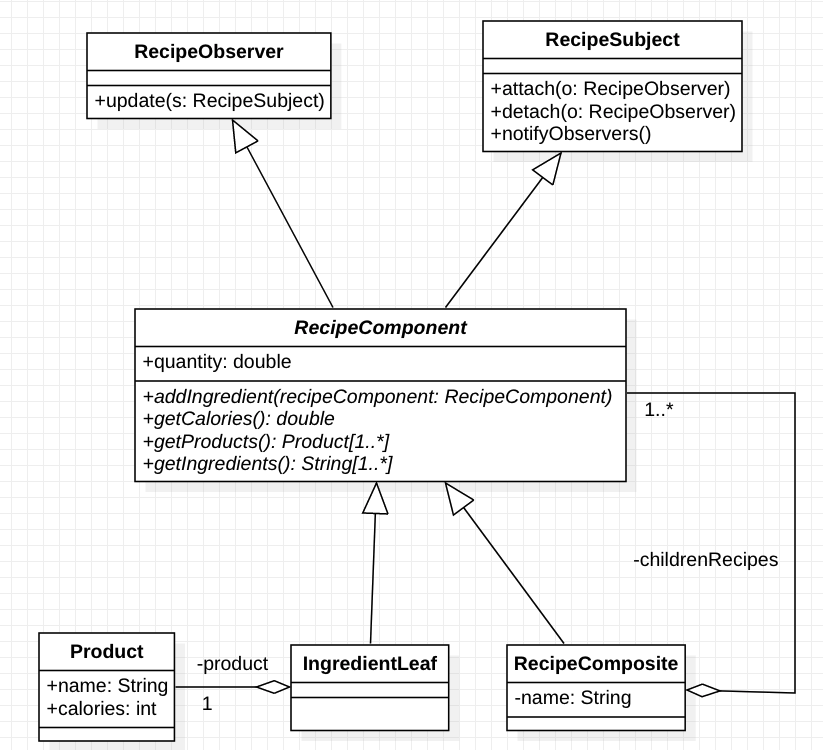

# Lista de Exercícios

## Identificação
**Professor**: Diego Pinheiro, PhD

**Disciplina**: Engenharia de Software 2

**Atividade**: Atividade Síncrona 01

## Instruções 
> 1. Sua implementação deve estar dentro da pasta src/**main**/java 
> 2. Não modifique nenhum código dentro da pasta src/**test**/java).
> 3. A submissão **não deve ser feita após o prazo** (nem 1 minuto a mais)

## Descrição da Atividade
A Figura a seguir ilustra `1` quantidade da receita `Family Dinner`. A receita `Family Dinner` contém `3` quantidades da receita `5-Minute Spaghetti`. A receita `5-Minute Spaghetti`, por sua vez, contém `2` quantidades do ingrediente `Spaghetti` e `3` quantidades da receita `Tomato Sauce`. A receita `Tomato Sauce`, por sua vez, contém `1` quantidade do ingrediente `Olive Oil`, `1` quantidade do ingrediente `Garlic`, e `3` quantidades do ingrediente `Tomato`. 

Implemente o projeto de objetos para representar receitas culinárias. 
1. Utilize o padrão `Composite` para possibilitar que objetos terminais do tipo `IngredientLeaf` e composições de objetos do tipo `RecipeComposite` sejam tratados de maneira uniforme pelos clientes através de uma interface comum `RecipeComponent`;
2. Utilize o padrão `Observer` para possibilitar que objetos do tipo `RecipeComposite` sejam removidos automaticamente tão logo os seus filhos `RecipeComponent` forem removidos;
3. Considere todos os testes unitários fornecidos; 
   
A Figura a seguir apresenta o diagrama de classes do projeto de objetos em questão. 

