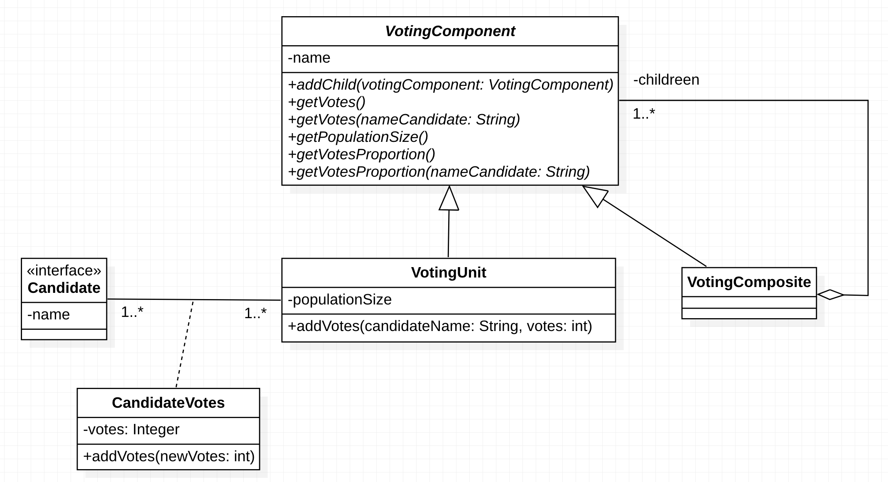

# Lista de Exercícios

## Identificação
**Professor**: Diego Pinheiro, PhD

**Disciplina**: Engenharia de Software 2

**Atividade**: Atividade Síncrona 

## Instruções 
> 1. Sua implementação deve estar dentro da pasta src/**main**/java 
> 2. Não modifique nenhum código dentro da pasta src/**test**/java).
> 3. A submissão **não deve ser feita após o prazo** (nem 1 minuto a mais)

## Descrição da Atividade
A Figura a seguir ilustra um diagrama de classes para um software de votação no Brasil.

Considere os testes fornecidos. A classe `TestBase` contém a inicialização dos objetos necessários para a `Pré-Condição` dos testes nas classes `TestCandidateVoting`, `TestCandidateVoting` e `TestVotingUnit`.

Implemente o projeto de objetos para representar um sistema de votação. 
1. Utilize o padrão `Composite` para possibilitar que objetos terminais do tipo `VotingUnit` e composições de objetos do tipo `VotingComposite` sejam tratados de maneira uniforme pelos clientes através de uma interface comum `VotingComponent`;
2. Considere todos os testes unitários fornecidos; 
